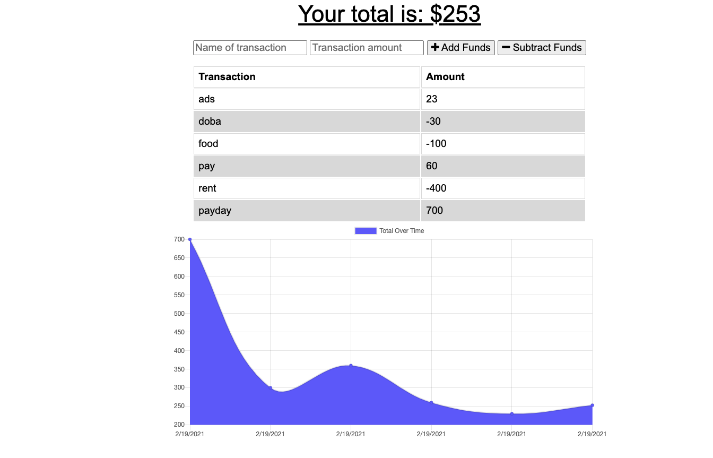

# Budget App

  ## Description
    This app allows users to track there finances. They can add and subtract funds adding titles to there transactions. There budget is displayed on a chart. The cool thing about this app is that it works offline as well by utilizing an indexeddb database that sends a bulk request when the client comes back online.

  ## Table of Contents

  *[Installation](#installation)

  *[Usage](#usage)

  *[Contributing](#contributing)

  *[Tests](#tests)

  *[Questions](#questions)

  ## Installation
  npm i

  ## Usage
  This app is live on heroku at https://pure-garden-99220.herokuapp.com/

  ## Contributing
  contact me

  ## Tests
  no testing is added to this project

  ## Questions
  tbond4
  tristanebond@gmail.com
  
